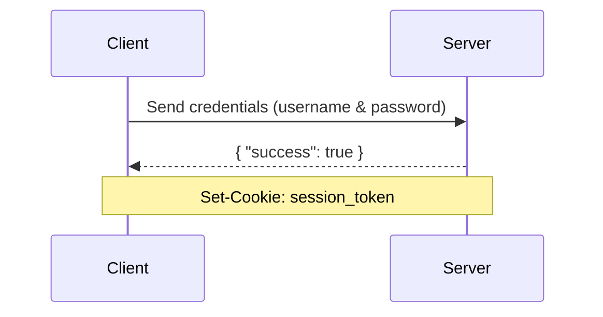
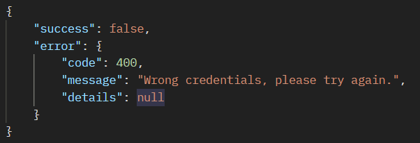
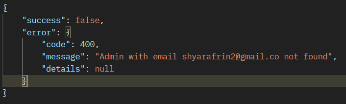

# POST /auth/signin

Sign in a user with email and password. Returns a session token you can use for authenticated requests.



---

### Request Body

<ParamField path="body" type="string" required>
  email
</ParamField>
<ParamField path="body" type="string" required>
  password
</ParamField>

<Panel>
<Tabs>
<Tab title="Request">
```typescript Request
export async function signIn(email: string, password: string): Promise<SignInResponse> {
  try {
    const { data } = await api.post<SignInResponse>("/auth/signin", { email, password });
    return data;
  } catch (err) {
    return normalizeAxiosError(err);
  }
}
```
</Tab>

<Tab title="Success">
```json Success wrap-option
{
    "success": true,
    "data": {
        "id": "3159fecd-f9f2-46ac-82c6-8054072dfff1",
        "fullname": "Shyar Afrini",
        "email": "shyarafrin2@gmail.com",
        "isActive": true,
        "profilePhoto": "https://link-to-profile-photo"
    }
}
```
</Tab>
</Tabs>
</Panel>

## Potential Errors

Wrong credentials (400) Bad Request

<Frame caption="Wrong Credentials error">
  
</Frame>

---

Admin Not Found (400) Bad Request

<Frame caption="Admin Not Found error">
  
</Frame>
