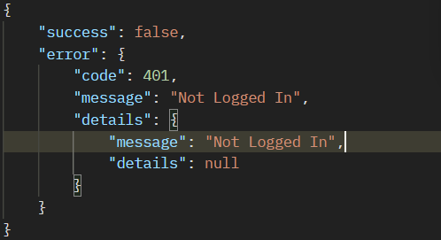
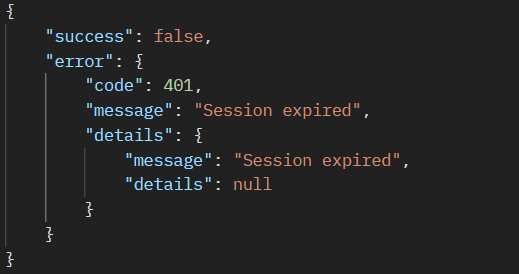

# POST /auth/session/validate

Checks wether the admin has a valid session

<Note>clears Session-token from the client side if expired</Note>

<Panel>
<Tabs>
<Tab title="Request">
```typescript Request
export async function validateSession(): Promise<ValidateSessionResponse> {
  try {
    await api.post<ValidateSessionResponse>("/auth/session/validate");
  } catch (err) {
    return normalizeAxiosError(err);
  }
}
```
</Tab>

<Tab title="Success">
```json Success
{
    "success": true,
    "data": {
        "expiresAt": 1759321112241,
        "message": "Session Expires At: 10/1/2025, 3:18:32 PM"
    }
}
```
</Tab>
</Tabs>
</Panel>

## Potential Errors

Not Logged In (401) UnAuthorized

<Frame caption="Not Logged in error">
  
</Frame>

---

Session Expired (400) Bad Request

<Frame caption="Session Expired error">
  
</Frame>
